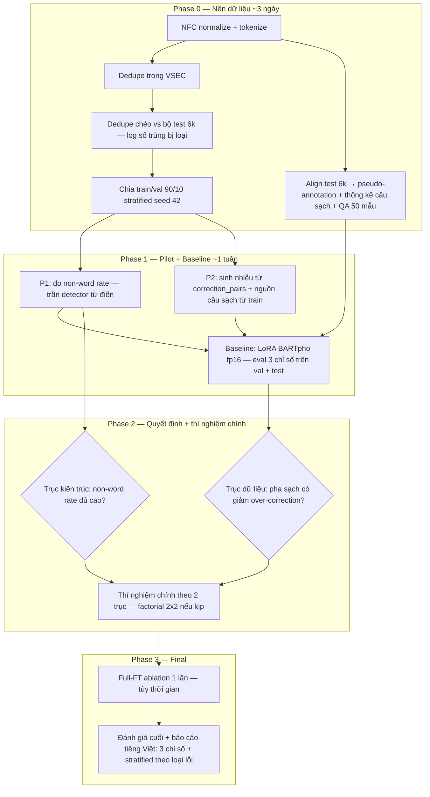

# DESIGN.md — Thiết kế đồ án Sửa lỗi chính tả tiếng Việt (VSEC)

> Trạng thái: **BẢN NHÁP chờ duyệt Phase 0** · Soạn ngày 22/09/2026
> Nguồn: phiên brainstorming theo skill `brainstorming-research-ideas` + các quyết định của người dùng.
> File này bổ sung cho `PROJECT.md` (bối cảnh & ràng buộc gốc), không thay thế.

## 1. Quyết định phạm vi đã chốt (ngày 22/09/2026)

| Hạng mục             | Quyết định                                                                                                                                                         |
| -------------------- | ------------------------------------------------------------------------------------------------------------------------------------------------------------------ |
| Nhiệm vụ             | Phát hiện + sửa lỗi chính tả tiếng Việt mức âm tiết                                                                                                                |
| Train/Val            | VSEC (9.341 câu) — chỉ dùng làm train + validation                                                                                                                 |
| Test                 | Bộ riêng **6.000 câu** tự thu thập từ web/báo, **chỉ có `text` + `corrected_text`** (không có annotation âm tiết)                                                  |
| Chia tập             | VSEC → train/val **90/10**, stratified theo `error_count` (binned), **seed 42**, dedupe trước khi chia                                                             |
| So sánh LLM few-shot | **Bỏ** (giải quyết mục treo §8 của PROJECT.md)                                                                                                                     |
| Hướng đóng góp chính | **Chưa chốt** — quyết sau pilot ~1 tuần, theo khung 2 trục (mục 3)                                                                                                 |
| Hình thức triển khai | **Kaggle notebook trước** — chưa xây project hoàn chỉnh; mọi code chạy trong notebook trên Kaggle (2× T4). Trích xuất thành module `src/` chỉ nếu sau này thật cần |
| Tài nguyên           | 2× T4 15GB trên Kaggle — **fp16** (T4 không hỗ trợ bf16), LoRA trước, full-FT 1 lần cuối làm ablation                                                              |

## 2. Thuộc tính bộ test & hệ quả bắt buộc

Bộ test tự thu thập từ web/báo → cùng nguồn thông tin với VSEC (báo chí + giáo dục) → **rủi ro trùng lặp cao nhất có thể**. Hệ quả:

1. **Module align âm tiết** (bắt buộc, không có trong thiết kế ban đầu): Levenshtein trên chuỗi token giữa `text` ↔ `corrected_text` để suy ra pseudo-annotation (vị trí lỗi, cặp lỗi/sửa). Không có nó thì không tính được bộ 3 chỉ số trên test. Module này **tự động trả lời câu hỏi test có câu sạch không** (câu không phát sinh edit = câu sạch — hiện chưa rõ, phải đo).
2. **QA alignment**: soát tay ~50 cặp câu sau align + đo tỷ lệ align thất bại; bộ test tự thu thập nên chất lượng bản sửa cũng cần kiểm tra.
3. **Dedupe chéo VSEC-train ↔ test bắt buộc**: exact + near-duplicate (rapidfuzz/MinHash; 9,3k × 6k cặp là nhẹ). Số trùng bị loại phải log và ghi vào báo cáo phương pháp.
4. **Chuẩn hóa nhất quán** ở cả 3 nơi (VSEC, test, output model): Unicode **NFC** (web Việt thường dính NFD), quy ước dấu câu tách space như VSEC ("sanh , sạch , đẹp"), tokenization âm tiết thống nhất.

## 3. Khung quyết định 2 trục (thay cho việc chọn 1 trong A/B/C ngay)

| Trục          | Từ → Đến                                                                                                       | Pilot trả lời      |
| ------------- | -------------------------------------------------------------------------------------------------------------- | ------------------ |
| **Dữ liệu**   | VSEC thuần → pha câu sạch (từ `corrected_text` train) + nhiễu tổng hợp (bootstrap từ `correction_pairs` train) | Pilot 2            |
| **Kiến trúc** | seq2seq thuần → hybrid từ điển âm tiết (C) / pipeline bảo thủ (A)                                              | Pilot 1 + baseline |

Hai trục **độc lập** — nếu thời gian cho phép, thí nghiệm chính là factorial nhỏ 2×2.

**Lý do nguồn câu sạch không cần dữ liệu ngoài**: `corrected_text` của tập train (sau dedupe + chia theo câu) là câu sạch hợp lệ, không vi phạm quy tắc leakage §5.

**Cơ sở ngôn ngữ học cho trục kiến trúc**: tiếng Việt có bảng âm tiết khép ≈8.000 → lỗi **non-word** bắt được bằng tra bảng với precision gần tuyệt đối; neural chỉ cần lo lỗi **real-word** cần ngữ cảnh (vd. `sanh`→`xanh` hợp lệ cả hai vế; `vàahệ` là non-word).

## 4. Lộ trình

**Pilot 1 — Non-word rate (1 ngày)**: xây bảng âm tiết từ từ điển công khai (Underthesea/VIETLEX — kiến thức công cộng, không phải label leakage). Đo trên VSEC-val: % lỗi mà âm tiết sai ∉ bảng.

**Pilot 2 — Chất lượng nhiễu tổng hợp (2–3 ngày)**: bootstrap mô hình nhiễu từ `correction_pairs` **train** (thay âm liền phím, hoán âm vùng miền s/x, tr/ch, r/d/gi, ng/n…), sinh câu lỗi từ `corrected_text` train, soát tay 50 mẫu.

## 5. Quy tắc quyết định explicit (Phase 2)

| Kết quả pilot/baseline                                | Hành động                                                                                              |
| ----------------------------------------------------- | ------------------------------------------------------------------------------------------------------ |
| Baseline over-correction < ~2–3% âm tiết              | Vấn đề không nghiêm trọng trên bộ test này → ưu tiên pipeline (A) hoặc dừng ở phân tích stratified sâu |
| Non-word rate ≥ ~40%                                  | Hybrid từ điển (C) có nền → kéo trục kiến trúc                                                         |
| Non-word rate thấp                                    | Bỏ C sớm, tiết kiệm effort                                                                             |
| Nhiễu Pilot 2 khó phân biệt với lỗi thật khi soát tay | Trục dữ liệu (pha sạch + nhiễu) khả thi                                                                |

## 6. Định nghĩa metric (bắt buộc tách 3 lớp — theo PROJECT.md §6)

- **Detection**: precision/recall/F1 của việc xác định đúng **vị trí âm tiết lỗi** (so với `error_positions` trên VSEC-val; so với pseudo-annotation suy từ align trên test).
- **Correction accuracy**: trong số vị trí detect đúng, tỷ lệ sửa đúng thành âm tiết gold.
- **Over-correction rate**: tỷ lệ âm tiết vốn đúng nhưng bị mô hình thay đổi.
- Thêm (theo khả năng bộ test): nếu test có câu sạch → **tỷ lệ giữ nguyên câu sạch** (mô hình phải xuất ra câu không đổi).
- Mọi chỉ số báo cáo kèm **phân tích stratified theo loại lỗi**: mistyped/misspelled × non-word/real-word.
- Cài đặt: cần align `source ↔ model output` để suy ra edit của model, rồi đối chiếu với gold edits. **Bookkeeping vị trí khi có chèn/xóa/merge/split ("vàahệ", "Tuy nh iên") là chỗ dễ sai nhất** — align là phần code duy nhất cần kiểm thử kỹ ngay từ đầu (trong notebook: chạy trên các case biên đã biết + soát tay mẫu).

## 7. Hình thức triển khai: notebook-first trên Kaggle

**Không xây cấu trúc project hoàn chỉnh ở giai đoạn này.** Mỗi phase một notebook Kaggle; các "module" dưới đây là **đơn vị logic bên trong notebook**, không phải file riêng:

| Notebook                        | Nội dung logic bên trong                                                                                                                                          |
| ------------------------------- | ----------------------------------------------------------------------------------------------------------------------------------------------------------------- |
| `nb0_data_prep.ipynb`           | load VSEC + test, NFC normalize, tokenize, dedupe (trong + chéo, có log), split 90/10 stratified seed 42, xuất file trung gian (CSV/JSON xuống `/kaggle/working`) |
| `nb1_align_annotate.ipynb`      | align âm tiết → pseudo-annotation cho test 6k, thống kê câu sạch, QA 50 mẫu (in mẫu để soát tay)                                                                  |
| `nb2_pilot_dict_noise.ipynb`    | bảng âm tiết + non-word rate (Pilot 1); mô hình nhiễu từ `correction_pairs` train + sinh câu sạch/nhiễu (Pilot 2)                                                 |
| `nb3_baseline_train_eval.ipynb` | LoRA BARTpho fp16, eval 3 chỉ số trên val + test, stratified theo loại lỗi                                                                                        |

Nguyên tắc: cell "hàm dùng chung" (align, metric) đặt ở đầu notebook và **copy nhất quán giữa các notebook**; chỉ khi bị sửa ở 2 nơi trở lên mới tính chuyện trích thành file `.py` chung. Mọi tham số (seed, tỷ lệ, ngưỡng) đặt gom một cell cấu hình ở đầu mỗi notebook.

Quy ước sau này nếu cần trích module (chỉ khi thật cần): `src/{data,align,annotate,eval,dict_detect,noise,train_lora}.py` + `tests/` cho align.

## 8. Danh sách ứng viên nghiên cứu đã phát sinh (lưu để tái kết hợp)

| ID     | Ý tưởng                                                          | Trạng thái                                                          |
| ------ | ---------------------------------------------------------------- | ------------------------------------------------------------------- |
| C1     | Baseline BARTpho + bộ 3 chỉ số                                   | **Bắt buộc**                                                        |
| C2     | Augmentation chống over-correction (pha sạch + nhiễu theo tỷ lệ) | Ứng viên trục dữ liệu                                               |
| C3     | Hybrid từ điển âm tiết + neural                                  | **Đã loại** (Non-word rate 22.7% < 40% ở Pilot 1, quyết định 22/09) |
| C5     | Pipeline 2 giai đoạn (giống paper VNU 2026, đơn giản hóa)        | Ứng viên trục kiến trúc                                             |
| C8     | Đánh giá stratified theo loại lỗi                                | **Nên có** — rẻ                                                     |
| C7     | So sánh LLM few-shot                                             | **Đã loại** (quyết định 22/09)                                      |
| C9     | Constrained decoding vào bảng âm tiết (trie-mask)                | Add-on tùy chọn                                                     |
| C10    | LoRA vs full fine-tune                                           | Ablation tự nhiên của quy trình                                     |
| C11    | Entity masking (từ paper 2026)                                   | Mở rộng                                                             |
| C12    | Bộ test câu sạch 100%                                            | Tự động thành hiện thực nếu test có câu sạch                        |
| C4, C6 | Labeling+ranking; copy mechanism                                 | Cất dành (phạm vi vượt đồ án)                                       |

## 9. Checklist chống data leakage (mở rộng §5 PROJECT.md cho bộ test ngoài)

- [ ] Dedupe (exact + near-dup) **trong** VSEC và **chéo** VSEC↔test **trước** khi chia tập.
- [ ] Chia theo câu, trước mọi thống kê toàn cục; stratified theo `error_count` binned; seed 42 cố định; log tỷ lệ + phương pháp.
- [ ] Augmentation (câu sạch + nhiễu tổng hợp) **chỉ trên train**; mô hình nhiễu bootstrap **chỉ từ `correction_pairs` train**.
- [ ] Bảng âm tiết từ nguồn công khai độc lập (không suy từ test).
- [ ] Không dùng nhãn test/dev để fit bất kỳ tham số/thống kê nào (align chỉ dùng để **đánh giá**, không phải fit).
- [ ] Log mọi số câu bị loại ở từng bước (dedupe, align fail) để tái lập.

## 10. Ghi chú tính toán (Kaggle 2× T4 15GB)

- fp16 + grad scaler (T4 không có bf16); batch nhỏ + gradient accumulation + grad checkpointing.
- LoRA trước để iteration nhanh (baseline + các tỷ lệ pha); full-FT ~6,5GB cho weights/grads/Adam — chạy được 1 lần cuối.
- DDP 2 GPU trên Kaggle notebook không đáng công với tập 9,3k câu (mỗi epoch vài phút) — 1 GPU train, 1 GPU eval.
- Giới hạn Kaggle 12h/session, 30h/tuần: dư dả.

## 11. Các mục còn treo (chờ dữ liệu pilot đo)

1. Tỷ lệ câu sạch trong bộ test 6k (align ở nb1 đã đo được).
2. Non-word rate trên VSEC (Pilot 1): **Đã xong ở nb2** — 22.7% (bảng chính 7.884 từ) / 15.4% (bảng generative) $\to$ **Đã chốt: Bỏ hướng C**.
3. Chất lượng nhiễu tổng hợp (Pilot 2): **Đã xong ở nb2** — non-word rate 51.6% vs train 23.4% (lệch 28.2%), tạm thời giữ nguyên cho nb3.
4. Over-correction của baseline: **Đã xong ở nb3/nb3b** — 0,75–0,81% (val) · 1,82–1,88% (test) < ngưỡng 2–3% $\to$ không nghiêm trọng; zero-shot 1,56% $\to$ có sẵn ở base model. Trục dữ liệu: giữ augmentation làm mặc định, hạ ưu tiên chống over-correction.
5. Phê duyệt Phase 0: **Đã thông qua** — Phase 0 + Phase 1 đã thực thi xong theo thiết kế này (22–23/09/2026).

## 12. Nhật ký quyết định

- 22/09/2026: Chọn "chạy pilot trước rồi quyết"; bỏ so sánh LLM; VSEC chỉ train/val (test riêng 6k câu text+corrected_text, nguồn web/báo); tài nguyên 2× T4 Kaggle.
- 22/09/2026 (phụ): Hình thức triển khai = **notebook Kaggle trước**, không xây project hoàn chỉnh. Bản thiết kế này được lưu vào `DESIGN.md` — chờ phê duyệt Phase 0.
- 22/09/2026 (sau pilot nb2): **Chính thức bỏ C (Hybrid từ điển âm tiết)** do tỷ lệ non-word trên VSEC chỉ đạt 22.7% (<40%), hơn 77% lỗi là real-word cần ngữ cảnh; chốt triển khai `nb3_baseline_train_eval.ipynb` với 2 run đối chứng (Run 1: baseline thuần, Run 2: kèm augmentation từ nb2) dùng `vinai/bartpho-syllable` LoRA fp16; đánh giá trên cả Val và Test 6k.
- 23/09/2026 (sau nb3 + nb3b): Baseline LoRA BARTpho hoàn tất — Detection F1 val 76,16% / test 76,43% (Run 1) và 74,67% / 80,45% (Run 2) → augmentation hiệu quả trên test (+4,0 F1, +6,3 recall), giữ làm thành phần mặc định. Over-correction 1,82–1,88% (test) < ngưỡng 2–3%, có sẵn ở zero-shot (1,56%) → không dồn lực chống over-correction; ưu tiên nâng recall + correction accuracy (test còn 66–68%). FP pattern deletion là điểm yếu chính → dự kiến post-processing eval-only trước khi train thêm. Pipeline (A) không làm trục chính (giá trị biên chỉ còn chống deletion); hybrid từ điển (C) đã loại từ 22/09.
- 23/09/2026: Chốt phạm vi Phase 2 — (1) error analysis stratified trên test, (2) post-processing chống deletion (thiết kế/tinh chỉnh trên val, áp frozen lên test), (3) Run 3 với noise hiệu chỉnh (non-word mục tiêu ~23–25%), (4) tùy quota: full-FT ablation. Factorial 2×2 và pipeline 2 giai đoạn: hoãn.
- 24/09/2026 (sau nb4 + nb4b): **Bước 1 Phase 2 hoàn tất** — error analysis stratified trên test, consistency check PASS tuyệt đối vs nb3: FP deletion **45,4%** tổng FP (Run 2) với pattern lặp cụ thể (dấu câu `,`, họ âm tiết `tòa/họa/khỏe/thỏa…`); 77,2% TP sửa sai là thay nhầm **từ thật**; 92% FN kiểu **under-edit** (recall thấp nhất ở câu 1 lỗi — 70,9%); test ≈ 82% gold positions là non-word vs val ~26% (proxy bảng âm tiết — đếm cả từ ngoại, đọc kèm hạn chế). Adjudication 100 mẫu suspect LLM-assisted (nb4b, `jev-latest`): nhiễu (B+D) **0,0%** (CI95 [0; 3,7%]) < ngưỡng 8% — nhánh đơn annotator nên đã chạy **audit người 25 mẫu blind (nb4c, hoàn tất 24/09): binary consensus 25/25 · full-label agreement 25/25 → chốt nhiễu 0,0% (human-audited)**, không hiệu chỉnh nhãn. Sensitivity của nb4 sửa diễn giải: là metric trên 100 câu adjudicate (subset suspect edit-dày), không phải exclusion toàn test. **Quyết định Bước 2**: post-processing chống deletion (punctuation guard · veto delete trên âm tiết hợp lệ · blacklist phrase từ val) — derive/tune trên val, áp frozen lên test, trần lý thuyết +2,33 F1; Run 3 giữ non-word mục tiêu **23–25%** (không tối theo thành phần ~82% non-word của test — chống test-peeking, chỉ report stratified); tùy chọn eval-only: multi-pass inference cho under-editing.
- 24/09/2026 (sau nb5): **Nhập đối sánh external với NomVN** (eval-only, plan riêng `.kilo/plans/1790234569000-nomvn-external-eval-ab.md`). Hướng A — Run 1/Run 2 trên `eval-real` (150 câu, CC0): WA ≈55,6% (+3,6pp trên identity floor 51,96%; anchor nhóm dẫn đầu nrl base 79,62%), tệ nhất ở news_real 31% / telex_real 15% → **phản bác giả thuyết "news/legal cạnh tranh"**, xác nhận lỗ hổng kiểu lỗi Telex/VNI nhiều phím (domain khớp ≠ kiểu lỗi khớp). Hướng B — `nomvn-base` trên test 6k: Detection F1 **87,26%** > Run 2 80,45% (recall +10,9 điểm; CorrAcc/over-correction ngang bằng) — confound khả năng trùng câu sạch test↔corpus Wiki+news của họ được ghi nhận nhưng **quyết định bỏ cross-dedupe** (tập trung pipeline nội bộ — so sánh giữ ở mức định hướng, confound là hạn chế đã công bố trong REPORT mục 10). Quyết định: (1) **mở gate rule Telex/VNI cho Run 3** (bằng chứng hai chiều từ bench ngoài + trong, không test-peeking — khi implement vẫn kiểm thống kê train); (2) Run 4 synthetic-scaled vẫn hoãn chờ quota; (3) hạ tầng notebook phải `transformers<5` (bug v5 với tokenizer sentencepiece — trùng khuyến nghị cài đặt của chính NomVN); (4) cross-dedupe test↔corpus của họ loại khỏi scope theo quyết định 24/09. Chi tiết số liệu: REPORT.md mục 12.
